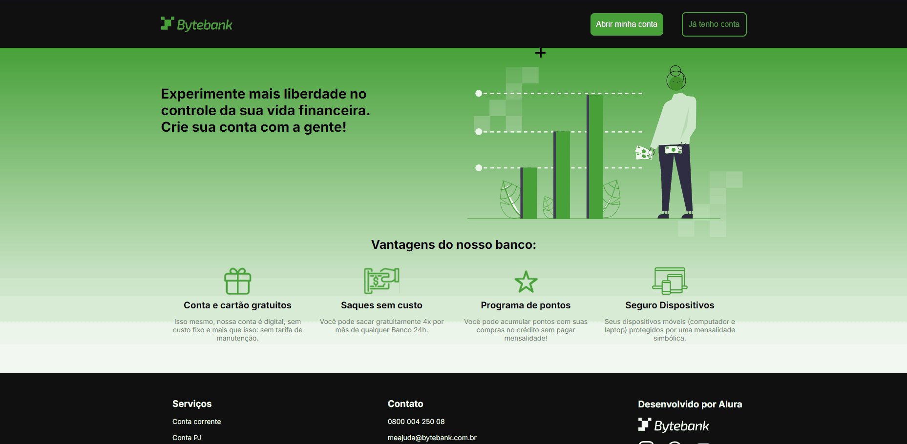

# ByteBank 🏧

#### Ajustar CSS positions

Digital bank, where you will have the history of all transactions and control your money in the palm of your hand.

#### Feel free to explore, and if you have any questions, I'm available 24/7 for you 🫵

    

#### Link to the Website 🎯

    

#### ⬇️You can reach me at⬇️

 
    
    
    
     
    <h2>vinii.viniciusribeiro@gmail.com</h2>

#### Tecnologias utilizadas neste projeto 🤖

#### Knowledge Gained During the Process🤓

- Set up ESLint along with Prettier to perform static analysis of your code during development;

- Write a test for a React component;

- Use query functions like getByText, getAllByRole, and queryByText;

- Perform snapshot testing;

- Use userEvent() to simulate user interactions with the page;

- Better organize your tests by using describe() to add a general description for your tests;

- Test components that receive props;

- Ensure that your list components display dynamic data and not static HTML in your code;

- Stub function behaviors;

- Test events with onSubmit, which is triggered when submitting form data;

- Mock a function with jest.fn();

- Test functions that are part of your business logic, such as a function that calculates a new balance;

- Write tests with stubbed functions and start thinking of new features for your application even before they are implemented;

- Had your first contact with TDD, which stands for Test Driven Development, and can be understood as Test-Oriented Development;

- How to write better tests with good practices and clear language;

- How to protect your production application from untested code that has been added to your app.
